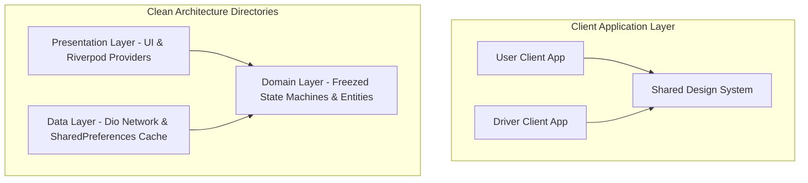

# 🚑 Rescue Link - Ambulance Booking & Dispatch System

Rescue Link is a startup-grade, production-style Flutter monorepo solution designed to automate and streamline emergency ambulance booking, dispatch tracking, and driver transit coordination. Inspired by industry-leading ride-sharing platforms like Uber and Ola, the system is designed as a unified workspace containing two client applications powered by a centralized, robust shared design system.

---

## 🏗️ Architectural Overview & Design Patterns

The project is structured under **Clean Architecture** guidelines, ensuring a decoupled separation of concerns where business rules are completely independent of visual interfaces, external APIs, and local caching layers.



### 1. The Monorepo Workspace Pattern
Both apps (`user_app` and `driver_app`) are unified as a **Flutter Workspace**. This prevents dependency drift and allows instant compilation across the entire monorepo in a single command. 

### 2. Centralized Shared Design System (`packages/shared`)
To eliminate styling redundancy and ensure perfect visual consistency, all custom themes, typography bindings (Google Fonts Outfit & Inter), color tokens, and custom buttons are consolidated in a separate local package. Both client apps depend on this package for their UI scaffolding.

### 3. Separation of Concerns (Layered Features)
Each feature inside `user_app` and `driver_app` is split into:
*   **Domain Layer**: Houses the ultimate core business logic. Defines data models and repositories as abstract contracts. Uses code-generated `freezed` models to represent compiler-verified state machines.
*   **Data Layer**: Responsible for executing data retrieval. Implements repository contracts, manages local persistent configurations (`SharedPreferences`), and structures dynamic network requests (`DioClient`).
*   **Presentation Layer**: Responsible for visual rendering. UI elements observe Riverpod state providers which reactively update layouts based on incoming state events.

---

## 📁 Repository Directory Structure

```text
ambulance_system/
├── pubspec.yaml                       (Monorepo workspace configuration)
├── packages/
│   └── shared/                        [Unified UI Core & Design System]
│       ├── lib/
│       │   ├── shared.dart            (Core exports)
│       │   └── theme/
│       │       ├── app_colors.dart    (Curated premium palettes)
│       │       └── app_theme.dart     (Light/Dark typography and styling)
│       └── pubspec.yaml               (Shared metadata & Google Fonts config)
│
└── apps/
    ├── user_app/                      [User/Patient Client Application]
    │   ├── lib/
    │   │   ├── main.dart              (Pre-initializes SharedPreferences & boots app)
    │   │   ├── config/
    │   │   │   └── router/            
    │   │   │       └── app_router.dart(GoRouter guards decoupled from state changes)
    │   │   ├── core/
    │   │   │   ├── storage/           (Persistent token cache & autologin)
    │   │   │   └── network/           (Dio client with dynamic bearer header injection)
    │   │   └── features/
    │   │       ├── auth/              (User Login & OTP verification features)
    │   │       │   ├── data/          (Auth API repository + mock network delays)
    │   │       │   ├── domain/        (Freezed union states: initial, loading, authenticated)
    │   │       │   └── presentation/  (Wired screens & active timer providers)
    │   │       └── booking/           (Live location, map, & booking feature flow)
    │   └── pubspec.yaml
    │
    └── driver_app/                    [Driver Client Application]
        ├── lib/
        │   ├── main.dart              (Initializes local session & driver configs)
        │   ├── config/
        │   │   └── router/            
        │   │       └── driver_router.dart (Enforces Badge ID auth guards)
        │   ├── core/
        │   │   ├── storage/           (Driver session persistence)
        │   │   └── network/           (Dynamic network interceptors)
        │   └── features/
        │       ├── auth/              (Badge ID validation & driver profiles)
        │       └── driver/            (Incoming flashing emergency dispatches, maps)
        └── pubspec.yaml
```

---

## 🛠️ Technical Stack & Dependencies

| Layer | Technology / Package | Details |
| :--- | :--- | :--- |
| **Framework** | **Flutter (3.41.9)** | Cross-platform client framework. |
| **Language** | **Dart (^3.11.5)** | Structured, compiler-safe client language. |
| **State Management**| **Flutter Riverpod (^2.6.1)** | Unidirectional reactive state provider. |
| **State Machines**  | **Freezed (^2.5.8)** | Union types for compiler-checked screen states. |
| **Navigation** | **GoRouter (^14.8.1)** | Declarative, type-safe path routing. |
| **Networking** | **Dio (^5.9.2)** | Advanced HTTP client with header interceptors. |
| **Local Session** | **SharedPreferences (^2.5.5)** | Persistent cache for automated autologin. |
| **Typography** | **Google Fonts (^6.3.3)** | Integrated Google Fonts (Outfit & Inter). |

---

## 🔑 Key Engineering & Implementation Highlights

### 1. Union-State Freezed State Machines
To make invalid UI configurations completely impossible (e.g. showing a loading spinner concurrently with a success state), simple boolean logic is replaced by strict Union States:
```dart
@freezed
class AuthState with _$AuthState {
  const factory AuthState.initial() = _Initial;
  const factory AuthState.loading() = _Loading;
  const factory AuthState.codeSent() = _CodeSent;
  const factory AuthState.authenticated() = _Authenticated;
  const factory AuthState.unauthenticated() = _Unauthenticated;
  const factory AuthState.error(String message) = _Error;
}
```
This forces developers to exhaustively cover all possible states at compile-time when using pattern matching.

### 2. Asymmetric Auth Session Persistence
Splash screens asynchronously request token states from `SharedPreferences` at startup. If an active session token is identified, the app performs a silent login, automatically routing the user directly to the home screen and bypassing onboarding/login gates.

### 3. Decoupled Route-Guard Bridge
To avoid standard `invalid_override` conflicts between `StateNotifier` and `ChangeNotifier`, the project implements a decoupled `RiverpodRouterListenable`. This class bridges the reactive Riverpod auth states into GoRouter's imperative path redirects, ensuring route transitions are perfectly automated.

### 4. Dynamic Network Interceptor
Outbound requests routed through the custom `DioClient` automatically intercept transactions to read session tokens from `LocalStorage` and inject them as secure `Bearer` tokens in the `Authorization` header.

---

## 🚀 Deployment & Local Execution

Both applications compile directly to highly optimized production web builds.

### **1. Resolve Workspace Dependencies**
From the monorepo root directory, resolve the packages across all modules:
```powershell
flutter pub get
```

### **2. Launch Local Static Servers**
Concurrently host both client portals in separate terminal sessions:

```powershell
# Host the User/Patient Portal on Port 8888
python -m http.server 8888 --directory "apps/user_app/build/web"

# Host the Driver Dashboard Portal on Port 8889
python -m http.server 8889 --directory "apps/driver_app/build/web"
```

*   **User Client App**: [http://localhost:8888](http://localhost:8888)
*   **Driver Dashboard App**: [http://localhost:8889](http://localhost:8889)
